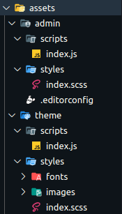

# Setup Build child theme in Wordpress

1 - Clone o seguinte repositório na sua máquina: _[Boilerplate - Child Theme](https://github.com/Apiki/Boilerplate-Child-Theme)_

2 - Copie todos os arquivos dentro da pasta com o tema filho.

3 - No arquivo `package.json` altere o nome do tema logo no início:

```json
{
  "name": "{Nome do tema filho}",
  "version": "1.0.0",
  "main": "index.js",
  "license": "MIT",
  "devDependencies": {
    "babel-eslint": "10.0.3",
```
4 - Navegue até o diretório e rode o comando `yarn install`. Certifique-se de usar uma versão do Node compatível com as dependências. Uma versão compatível é a v12.20.1

5 - Se tudo tiver dado certo, rode o comando `yarn build` e ao tentar fazer o build, alguns arquivos não estarão lá. Adicione no diretório `assets` dentro de `admin` e `themes` os diretórios `scripts` e `styles` com os arquivos `index.js` e `index.scss` respectivamente.
No final, você deverá ter uma estrutura de arquivos assim:



6 - No arquivo `functions.php` adicioner o seguinte código, alterando o nome do tema:

```php
function theme_enqueue_assets() {
	/**
	 * Enqueue style.
	 */
	wp_enqueue_style(
		'salient-child',
		get_theme_file_uri( '/dist/theme.css' ),
		[],
		filemtime( get_theme_file_path( '/dist/theme.css' ) )
	);
	/**
	 * Enqueue script.
	 */
	wp_enqueue_script(
		'salient-child',
		get_theme_file_uri( '/dist/theme.js' ),
		filemtime( get_theme_file_path( '/dist/theme.js' ) ),
		true
	);
}
add_action( 'wp_enqueue_scripts', 'theme_enqueue_assets' );

```

7 - Rode `yarn build` novamente e o bundler deve gerar todos os arquivos do tema no diretório `dist`.

8 - (Opcional): para adicionar estilos à página, crie arquivos _sass_ e importe eles no arquivo `assets/theme/styles/indes.scss`